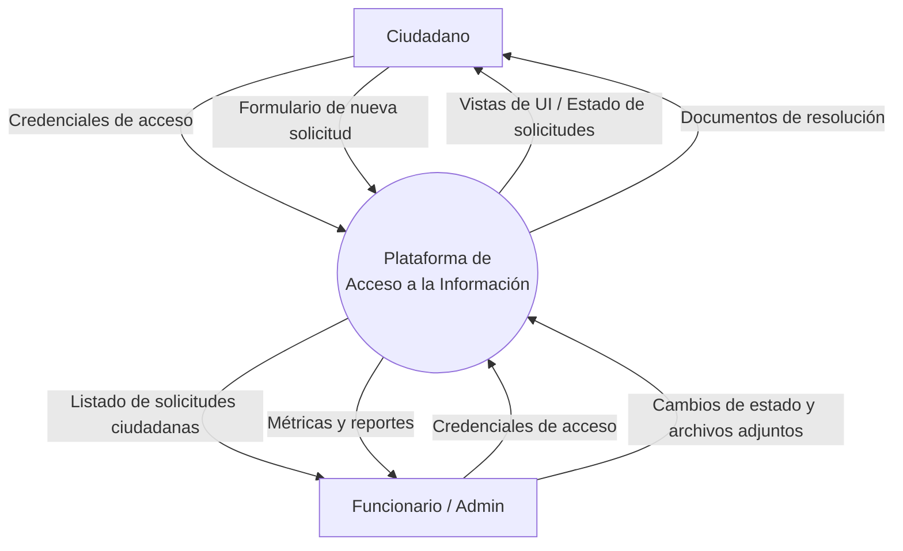
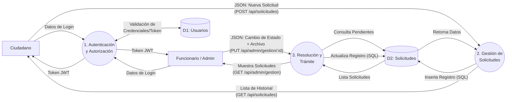

# Ingenieria-web-y-movil

### Integrantes
- Julian Guerrero
- Isidora Osorio
- Benjamin Muñoz

## Requerimientos

### Funcionales
1. El usuario podra exportar datos en formato csv
2. El usuario podra filtrar información por categoria.
3. El usuario podra comparar entre dos años.
4. El sistema debe transformar los datos procesados en representaciones gráficas de manera automatizada.
5. El sistema debe automatizar la recopilación de datos, sin requerir intervención manual.
6. El sistema debe ser capaz de poder represantar nueva informacion de nuevas variables que se ingresen (escalabilidad de datos).
7. EL sistema debe poder comunicarse y compartir informacion con otras plataformas como por ejemplo manejar datos tipo xml o json.

### No Funcionales
1. El sistema deberá recopilar datos con una periodicidad de 24 horas.
2. El sistema debe garantizar que las datos se almacenan de manera segura y no puedan ser modificadas posteriormente por el usuario.
3. El sistema debe mantener los estandares de accesibilidad y estilo que debe tener una página de la Municipalidad de Santo Domingo.

## Justificación del Problema y análisis de usuario objetivo
El problema se basa en la complejidad a la hora de buscar información especifica acerca de las finanzas de la municipalidad, siendo esta confusa y difícil de utilizar para una persona que no este acostumbrada al sistema actual, por lo que se busca mejorar la forma en la que la información es presentada añadiendo elementos gráficos y manteniendo funcionalidades previas, permitiendo exportar datos que el usuario requiera.

El usuario objetivo es cualquier persona que requiera los datos, estos pueden ser personas que ya tenían experiencia utilizando computadoras y el portal anterior, o personas que nunca han utilizado el portal y cuyo manejo de computadora no es bueno.

## Mokups
Figma: https://www.figma.com/design/7KgyeRm3cqbBRMuQtmwOFZ/Sin-t%C3%ADtulo?node-id=0-1&t=vAxNeJ8eZeT634Jr-1

Prototipo: https://www.figma.com/proto/7KgyeRm3cqbBRMuQtmwOFZ/Ingenieria-web-y-movil-Proyecto-33-Santo-Domingo?node-id=0-1&t=J0LT4jJa8ZKz1tPX-1

## Arquitectura de navegación y Experiencia del usuario

### Rutas principales y secundarias & Relaciones jerárquicas entre vistas

```text
 / (Raíz Pública)
 ├──  /login                    -> Autenticación de usuarios
 └──  /registro                 -> Creación de cuenta (Validación de RUT y datos)

 /app (Área Privada - Rol Ciudadano)
 ├──  /app/inicio               -> Panel resumen y accesos directos
 ├──  /app/solicitudes          -> Historial de requerimientos
 │    ├──  /app/solicitudes/nueva -> Formulario para ingresar solicitud
 │    └──  /app/solicitudes/:id   -> Detalle de solicitud y respuesta
 └──  /app/perfil               -> Configuración de cuenta

 /admin (Área Privada - Rol Funcionario/Admin)
 ├──  /admin/dashboard          -> Métricas globales y volumen de requerimientos
 ├──  /admin/gestion            -> Bandeja de entrada de requerimientos
 │    └──  /admin/gestion/:id     -> Vista de resolución y adjuntos
 └──  /admin/usuarios           -> Mantenedor de cuentas
```
La aplicación utiliza un sistema de enrutamiento anidado (`react-router`) que refleja la jerarquía de la información, dividida en un área pública y dos áreas privadas separadas por rol.

---
### Flujo de Navegación entre Funcionalidades
El flujo está diseñado para minimizar la carga cognitiva:

* Enrutamiento automático: Al autenticarse, el sistema dirige al usuario a /app/inicio o /admin/dashboard según su nivel de privilegios.

* Móvil (Navegación principal): Se gestiona a través de un IonTabs (barra inferior) para cambio rápido de contexto.

* Vistas secundarias: Para acceder al detalle de una solicitud, se utiliza una transición push en la pila de navegación, habilitando el botón de retroceso (IonBackButton) en el IonHeader para retornar al flujo principal sin perder el estado.

---
### Diferenciación de Acceso según Roles
La arquitectura implementa protección de rutas (Protected Routes) evaluando el JWT/estado de sesión:

* Ciudadano: Acceso exclusivo a rutas /app/*. Solo gestiona información vinculada a su identificador único (RUT).

* Funcionario: Acceso exclusivo a rutas /admin/*. Posee visibilidad transversal para tramitar solicitudes, pero no interactúa con las vistas de creación de usuarios finales.

* Nota: Accesos no autorizados son interceptados y redirigidos al /login o a una vista de Acceso Denegado.

---
### Flujo de Principales Tareas (Task Flow)
**Tarea 1: Ingreso de nueva solicitud (Ciudadano)**
1. Ingresa a /app/solicitudes.

2. Presiona el FAB (Floating Action Button) "Nueva Solicitud".

3. Navega a /app/solicitudes/nueva.

4. Completa el formulario (Categoría, Asunto, Descripción).

5. Presiona "Enviar".

6. Recibe confirmación visual (IonToast) y es redirigido a /app/solicitudes/:id para visualizar el comprobante.

**Tarea 2: Resolución de solicitud (Funcionario)**
1. Ingresa a /admin/gestion.

2. Filtra la bandeja por estado "Pendiente".

3. Selecciona un requerimiento y navega a /admin/gestion/:id.

4. Modifica el estado a "Respondida" y adjunta el documento de resolución.

5. Presiona "Guardar y Notificar" retornando a la bandeja principal.

---
### Flujo de Datos del Sistema (Arquitectura Lógica)
#### Diagrama de Contexto (Nivel 0)


---

#### Diagrama de Flujo de Datos (Nivel 1)


### Puntos Críticos de Interacción
* **Validación de Formularios:** Se realiza validación en tiempo real (RUT, formato de correo, contraseñas) para asegurar la integridad de la base de datos relacional.

* **Prevención de Duplicidad:** Durante el envío de solicitudes (operaciones POST), se bloquean los botones de acción mostrando un spinner (IonLoading) para evitar envíos múltiples por latencia de red.

* **Manejo de Archivos:** Las descargas de resoluciones proveen feedback visual en caso de que el archivo no esté disponible (Error 404/500).

---
### Coherencia de Experiencia entre Dispositivos
La UI es adaptativa (Responsive Design) empleando el sistema de grillas de Ionic:

* **Versión Móvil:** Prioriza interacción táctil. Uso de IonTabs (inferior) y división de formularios largos en pasos lógicos para evitar scroll excesivo.

* **Versión Web/Desktop:** Aprovecha el espacio horizontal reemplazando la barra inferior por un menú lateral fijo (IonSplitPane / IonMenu). Se implementan tablas de datos (data-tables) en lugar de tarjetas para optimizar la lectura de información densa.

---
### Justificación Técnica
* **Usabilidad y Rendimiento:** Componentes nativos como IonHeader, IonContent e IonItem aseguran tiempos de respuesta ágiles y patrones de interacción familiares (iOS/Android).

* **Claridad Estructural:** La separación lógica de directorios (/app vs /admin) en el frontend reduce el acoplamiento y facilita el mantenimiento concurrente por el equipo.

* **Escalabilidad:** React Router modularizado permite inyectar futuros roles (ej. Auditor) sin quebrar la lógica ni la seguridad de los roles preexistentes.
##
